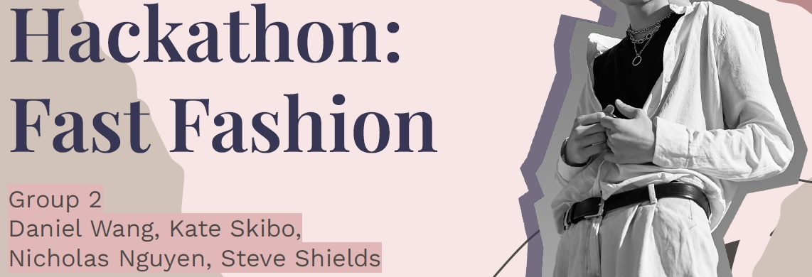
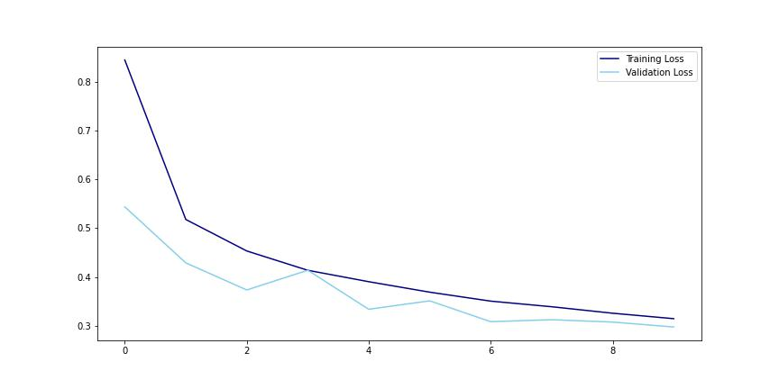
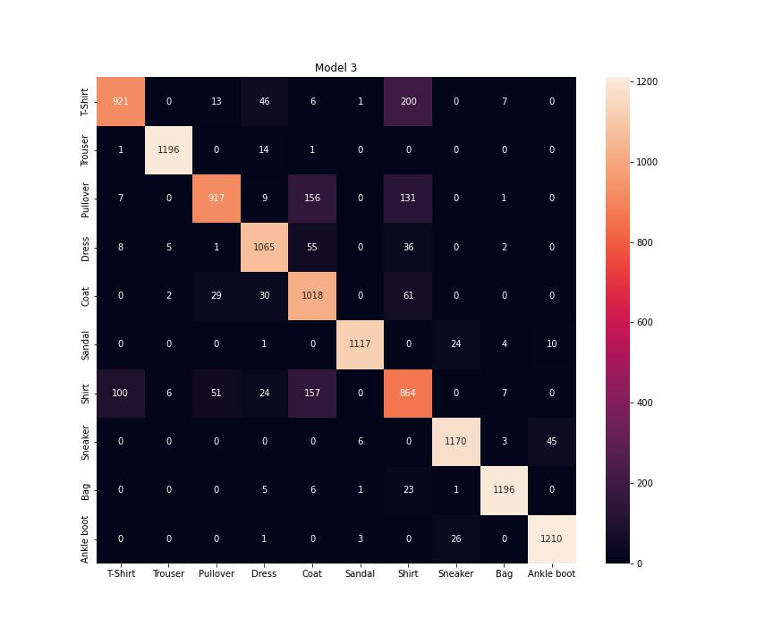

# Project 4 Hackathon

# 
## Neural Network Mini-hackathon Fashion MNIST

---
## Problem Statement

We are a team of militant insurgents from the planet Omicron-6.  We are a shapehifting race that can take on the appearance of other species.  Our spy network has uncovered intel that the leader of our arch-nemesis faction is meeting with his backers under deep cover during Fashion Week on alpha-Earth.  The intel states that he will be disguised in human form as a foreign dignitary during a notable fashion show.  We must therefore infiltrate the events to ASSASSINATE THE (fake) PRIME MINISTER OF MALAYSIA!

In order to blend in with the "fashionistas" at Fashion Week while biding our time for an opportunity to attack, we must build a working knowledge of the fashion of these Earth-bound bipeds.  To help us with this process, we have trained a computer model using neural networks to help us distinguish between their articles of clothing.

We used accuracy and loss as our metrics for gauging model performance.

---
## Executive Summary

We have built a computer model using neural networks to help us distinguish between their articles of clothing.  Our model has been trained using the Fashion-MNIST dataset (which is a dataset of Zalando's article images), consisting of 60,000 different 28-by-28 pixel grayscale photos of articles of clothing, with 10,000 examples of each of 10 classes, listed below:

|Label #|Item Type Label|
|---|---|
|0|T-shirt/top|
|1|Trouser|
|2|Pullover|
|3|Dress|
|4|Coat|
|5|Sandal|
|6|Shirt|
|7|Sneaker|
|8|Bag|
|9|Ankle boot|

# 
Our best perfroming model had a validation accuracy of 90.81%.  

# 
The most common misclassification by the model is that it classifies 6:shirts as 0:T-shirt/top or 4:Coat, which is understandable, as these are all sleeved upper body garments for humans with similar overall shape.

We ran several different models with different parameters for comparison.  Our best performing model was model 3: the model using 'rmsprop' as the Optimizer, with 3 layers and using Dropout.

---
## Data Background

Our data was asdfasdfasdfasdfsdfafdsaf

Our model was trained on data of 6,000 images each, of each of 10 different categories, shown in the table below:

10 prediction categories:

|Label #|Item Type Label|
|---|---|
|0|T-shirt/top|
|1|Trouser|
|2|Pullover|
|3|Dress|
|4|Coat|
|5|Sandal|
|6|Shirt|
|7|Sneaker|
|8|Bag|
|9|Ankle boot|

---
## Methodology

We constructed convolutional neural networks using Python, utilizing the Keras framework on top of the TensorFlow library.  Using Keras, we created a variety of sequential models, building layer by layer, trying different parameter values and the order and number of layers to find the best performing one.

### Model Descriptions

##### Model 1: 
2 layers
Flattened
No drop out
Batch size : 256
Epochs 10
Optimizer : rmsprop
Loss: 0.286
Accuracy : .90
Val_loss : .3161
Val_acc : .8898

##### Model 2:
2 layers
Flattened
Drop out of .5
Additional Dense Layer
Batch size : 256
Epochs 10
Optimizer : rmsprop
Loss: 0.3092
Accuracy : .88
Val_loss : .3249
Val_acc : .8752

##### Model 3:
3 layers
Flattened
Drop out of .5
Additional Dense Layer
Batch size : 256
Epochs 10
Optimizer : rmsprop
Loss: 0.1959
Accuracy : .9273
Val_loss : .2534
Val_acc : .9081

##### Model 4:
3 layers
Flattened
Drop out of .5
Additional Dense Layer
Batch size : 256
Epochs 10
Optimizer : Adam
Loss: 0.1565
Accuracy : .9429
Val_loss : .2708
Val_acc : .9013

---
## Primary Findings

# 
Our best perfroming model had a __________ accuracy of ______%.  

# 
The most common misclassification by the model is that it classifies 6:shirts as 0:T-shirt/top or 4:Coat, which is understandable, as these are all sleeved upper body garments for humans with similar overall shape.

We ran several different models with different parameters for comparison.  Their performance is shown in the table and below:

|Model #|Layers|Dropout|Loss|Accuracy|Val_loss|Val_Acc|
|---|---|---|---|---|---|---|
|1|rmsprop|2|No|0.286|0.9009|0.3161|0.8898|
|2|rmsprop|2|Yes|0.3092|0.8876|0.3249|0.8752|
|3|rmsprop|3|Yes|0.1959|0.9273|0.2534|0.9081|
|4|Adam|3|Yes|0.1565|0.9429|0.2708|0.9013|

Our best performing model was model 3: the model using 'rmsprop' as the Optimizer, with 3 layers and using Dropout.

---
## Conclusions/Epilogue

The most common misclassification by our model is that it classifies Shirts as either T-shirt/top or Coat… which is understandable, as these are all sleeved upper body garments for humans with similar overall shape.

Unfortunately, this proved to be a fatal mistake.  Our deep cover operative made a critical blunder and blowing his cover at a Fashion Week cocktail party, mis-referring to an attendee’s shirt as a coat (because that’s what the computer told him).  Records scratched, music stopped, and all eyes turned to the impostor in their midst.  As a result, the enemy leader was alerted to our plot and escaped off-world.  We have no choice but to return to Omicron-6 and await our next assassination opportunity.

---
## Sources & References

1.  [`Fashion MNIST dataset on Kaggle`](https://www.kaggle.com/datasets/zalando-research/fashionmnist?select=fashion-mnist_train.csv) 